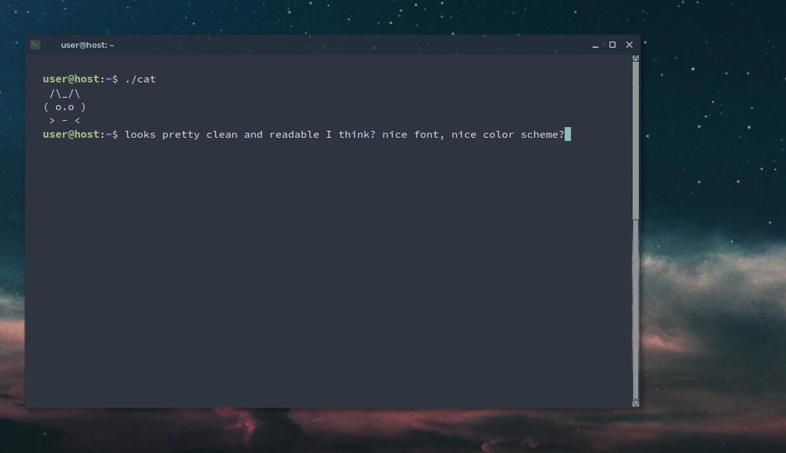

## Nord Palette for urxvt ~ .Xresources file

I actually don't use xterm or urxvt but started tweaking my .Xresources file and wanted to make a prettier urxvt than I had originally and I feel I accomplished that. The inspiration/color scheme came from the iconic Nord theme we all love. So I take that back, maybe I will start using urxvt as my go-to terminal emulator in the future, I enjoy messing with it and love the depth of customization available for it, lots more to uncover!

### To do:
* Add keybindings, perhaps utilize the same keybindings nano uses.
* See what I can do to the scrollbar, make it more aesthetically pleasing.
* Make urxvt as useable for myself as any other terminal emulator.

